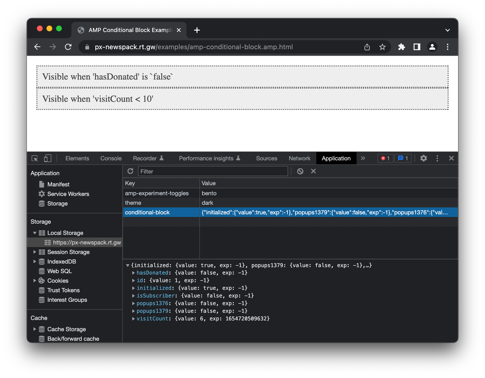
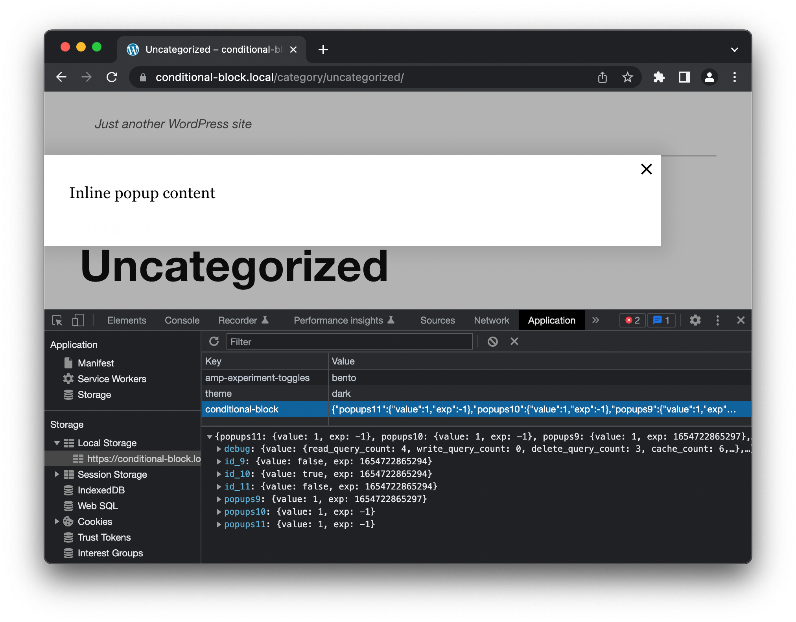

# Local Testing

This guide is designed the incontext of testing and analysing Newspack Popups with `amp-conditional-block`.

To test out `amp-conditional-block` with Newspack Popups, [localWP](https://localwp.com) as a local WordPress development tool is used.

## Setup: AMP Runtime Host

Clone experimental AMPHTML   repository:

```shell
# Clone repository
git clone https://github.com/rtCamp/amphtml.git

# Switch to experimental component branch
git checkout experimental/bento/conditional-block
```

Now, goto the the cloned directory, initialize repository and install dependencies:

```shell
cd amphtml/

# Install dependencies
npm i
```

Build and prepare "AMP Runtime":

```shell
# Clean existing build
amp clean

# Prepare new build
amp build

# Prepare new dist
amp dist
```

Start "AMP Local Server":

```shell
amp
```

Now, "AMP Runtime" is available on `http://localhost:8000/dist`.

### Important
- When testing locally, do not use [~~v0.js~~](http://localhost:8000/dist/v0.js) instead use [amp.js](http://localhost:8000/dist/amp.js).
- To use unminified script for debugging purpose, use `*.max.js` instead of `*.js`. Example:
  ```
  # Minified
  http://localhost:8000/dist/v0/amp-conditional-block-1.0.js

  # Unminified with debugging support
  http://localhost:8000/dist/v0/amp-conditional-block-1.0.max.js
  ```

## Usage: Stand-alone Webpage



```html
<!DOCTYPE html>
<html ⚡ lang="en">
  <!-- prettier-ignore -->
  <head>
    <meta charset="utf-8" />
    <link rel="canonical" href=".">
    <title>AMP Conditional Block Example</title>
    <meta
      name="viewport"
      content="width=device-width,minimum-scale=1,initial-scale=1"
    />
    <style amp-boilerplate>body{-webkit-animation:-amp-start 8s steps(1,end) 0s 1 normal both;-moz-animation:-amp-start 8s steps(1,end) 0s 1 normal both;-ms-animation:-amp-start 8s steps(1,end) 0s 1 normal both;animation:-amp-start 8s steps(1,end) 0s 1 normal both}@-webkit-keyframes -amp-start{from{visibility:hidden}to{visibility:visible}}@-moz-keyframes -amp-start{from{visibility:hidden}to{visibility:visible}}@-ms-keyframes -amp-start{from{visibility:hidden}to{visibility:visible}}@-o-keyframes -amp-start{from{visibility:hidden}to{visibility:visible}}@keyframes -amp-start{from{visibility:hidden}to{visibility:visible}}</style>
    <noscript><style amp-boilerplate>body{-webkit-animation:none;-moz-animation:none;-ms-animation:none;animation:none}</style></noscript>
    <style amp-custom="">
      body { padding: 20px; } 
      section { color: #444; background: #eee; font-size: 120%; border: 2px dotted; padding: 10px; }
    </style>
    <script
      async
      custom-element="amp-conditional-block"
      src="http://localhost:8000/dist/v0/amp-conditional-block-1.0.js"
    ></script>
    <script async src="http://localhost:8000/dist/amp.js"></script>
    <script>
      (self.AMP = self.AMP || []).push(function (AMP) {
        AMP.toggleExperiment('bento', true);
      });
    </script>
    <script id="conditional-block" type="application/json">
      {
        "top_level": {
          "default_operation": {
            "type": "GET",
            "url": "https://px-newspack.rt.gw/examples/sample-1.json",
            "options": {
              "method": "GET"
            },
            "parameters": "0280"
          }
        },
        "hasDonated": {
          "default_operation": {
            "type": "variable",
            "operation": "hasDonated = false"
          },
          "condition": "hasDonated",
          "true_operation": null,
          "false_operation": {
            "type": "GET",
            "url": "https://px-newspack.rt.gw/examples/sample-1.json",
            "options": {
              "method": "GET"
            },
            "parameters": {
              "_ga": "$COOKIE['_ga']",
              "visitCount": "$LOCALSTORAGE['visitCount']"
            }
          },
          "expiration": "weekly"
        },
        "visitCount": {
          "default_operation": {
            "type": "variable",
            "operation": "visitCount = 5"
          },
          "condition": "visitCount < 10",
          "true_operation": {
            "type": "variable",
            "operation": "visitCount = visitCount + 1"
          },
          "false_operation": null,
          "expiration": "daily"
        }
      }
    </script>
  </head>
  <body>
    <amp-conditional-block> </amp-conditional-block>
    <section conditional-block="hasDonated" hidden>
      Visible when 'hasDonated' is `true`
    </section>
    <section conditional-block="NOT hasDonated" hidden>
      Visible when 'hasDonated' is `false`
    </section>
    <section conditional-block="visitCount < 10" hidden>
      Visible when 'visitCount < 10'
    </section>
  </body>
</html>
```

## Usage: Newspack Popups



Install [localWP](https://localwp.com) and create a new website named `conditional-block` with default settings.

### Clone

Once, `localWP` is ready with new website `conditional-block`, open terminal and go to `conditonal-block/app/public/wp-content/plugins`

```shell
# Goto your website's plugin directory
cd app/public/wp-content/plugins
```

Now, clone experimental `Newspack Popups` repository, switch to testing branch and initialise:

```shell
# Clone repository
git clone https://github.com/rtCamp/newspack-popups.git

# Goto 'Newspack Popups' directory
cd newspack-popups

# Switch to experimental branch
git checkout  experiment/bento/conditional-block

# Install dependencies
npm i

# Clean any existing dist build
npm run clean

# Build new dist using 'newspack-scripts'
npm run build
```

### Install 'Newspack' Plugin

Install `Newspack` plugin from [official release](https://github.com/Automattic/newspack-plugin/releases) page.

### Setup plugin

It is important to configure `Newspack Popups` plugin to use "AMP Runtime" from `localhost`. To do so, update [`class-newspack-popups-inserter.php#L85`](https://github.com/rtCamp/newspack-popups/blob/859917dbb5297fa6f7e1cc2777ea557073866f21/includes/class-newspack-popups-inserter.php#L85) as below:

```php
self::$target_domain = "http://localhost:8000/dist";
```

Also, we need to update [`class-newspack-popups-inserter.php#L858`](https://github.com/rtCamp/newspack-popups/blob/859917dbb5297fa6f7e1cc2777ea557073866f21/includes/class-newspack-popups-inserter.php#L858) `script` url for localhost:

```php
$path = self::$target_domain . "/v0/{$script}-0.1.max.js";
```

Now, activate `Newspack` and `Newspack Popups` plugin.

To test `Newspack Popups` with `amp-conditional-block`, create a new Popup, visit site and analyse localStorage for various frequency.

### Known Issues

Experimental `Newspack Popups` plugin is not compatible with following plugins:
- AMP
- PWA

Please disable above plugins.

> AMP by-default adds "AMP Runtime" from official AMP CDN. In case of this component, it is experimental and won't be available from official AMP CDN and thus it is required to disable it so `Newspack Popups` can enqueue scripts from `http://localhost:8000/dist`.